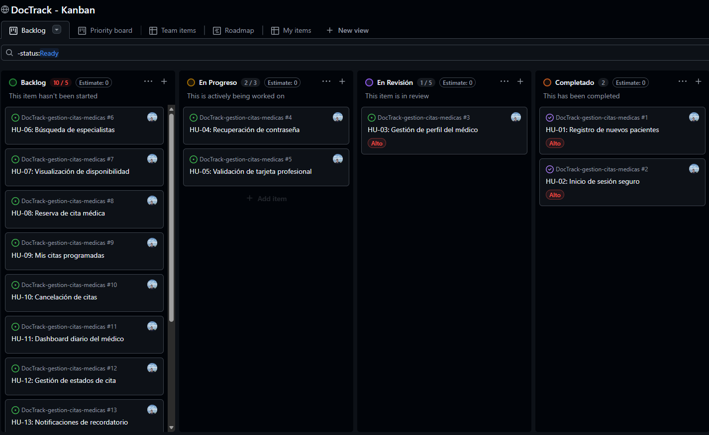
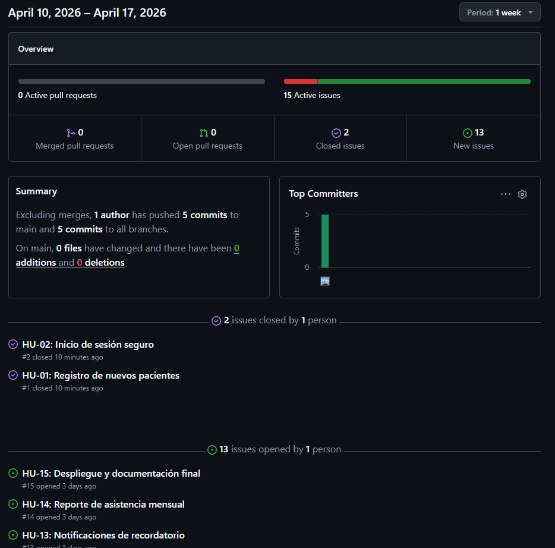
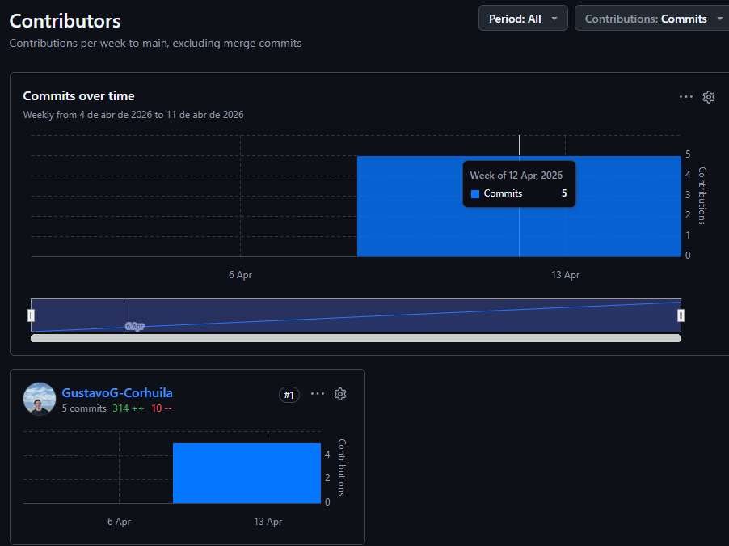
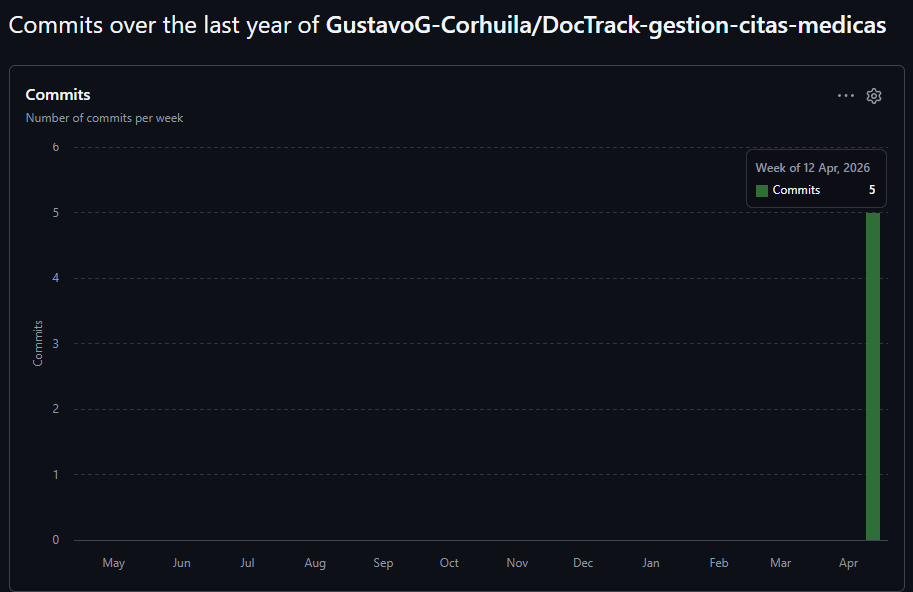

# Informe de Progreso - Sprint 1

## 1. Resumen del Sprint
- Fecha de inicio: 14/04/2026
- Fecha de fin: 28/04/2026
- Issues planificados: 5
- Issues completados: 2
- Issues en revision: 1
- Issues en progreso: 2

## 2. Estado del Tablero Kanban

Descripcion breve de la distribucion actual de los issues: se observan 2 issues en estado cerrado, 1 issue en revision y 2 issues en progreso, lo que refleja un avance parcial del sprint con trabajo activo en curso.

## 3. Analisis de GitHub Insights

### 3.1 Pulse

Interpretacion: el repositorio registra actividad continua durante el sprint, con cierre de issues planificados y varios commits asociados al desarrollo y seguimiento del backlog.

### 3.2 Contributors

Interpretacion: la contribucion principal corresponde al autor del repositorio, con distribucion de trabajo concentrada en una sola persona por tratarse de un proyecto individual.

### 3.3 Frecuencia de Commits

Interpretacion: hay picos de actividad en dias especificos del sprint; sin embargo, los commits se mantienen distribuidos en el periodo y no totalmente concentrados en un solo dia.

## 4. Reflexion
- El tablero muestra un ritmo de avance estable, con cierre de historias clave y tareas en curso que permiten continuidad para el Sprint 2.
- En el Sprint 2, priorizaria reducir el trabajo en progreso (WIP) y cerrar primero los issues en revision para mejorar el flujo.
- Una limitacion de GitHub Insights en un repositorio nuevo o individual es la baja profundidad de metricas comparativas y la poca diversidad de contribuciones.

## 5. Evidencia de Issues Cerrados
- [Issue #1 - HU-01: Registro de nuevos pacientes](https://github.com/GustavoG-Corhuila/DocTrack-gestion-citas-medicas/issues/1)
- [Issue #2 - HU-02: Inicio de sesion seguro](https://github.com/GustavoG-Corhuila/DocTrack-gestion-citas-medicas/issues/2)

## 6. Video de Avance Sprint 1
[Video de presentacion Sprint 1](https://drive.google.com/file/d/1YdkWi8zHfX9Qvic6lnuFYbyhSDx56leY/view?usp=sharing)