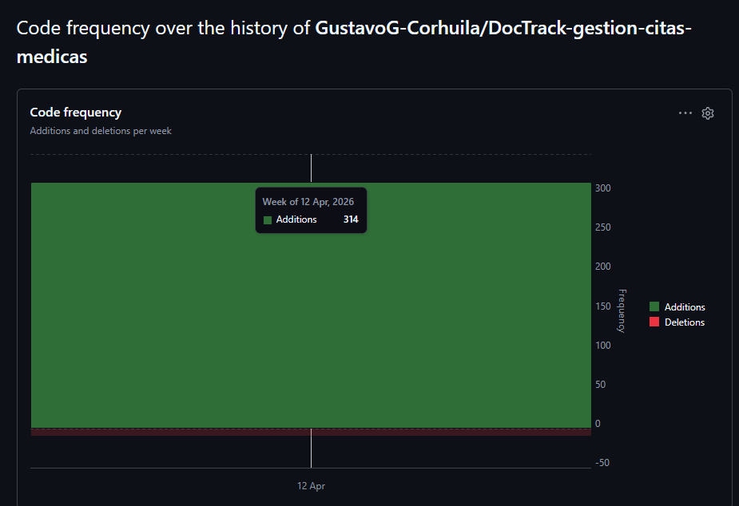

# Informe Académico de Avance

## Sprint 1 - Proyecto DocTrack

**Programa académico:** Especialización en Ingeniería de Software  
**Asignatura:** Desarrollo Ágil de Software  
**Proyecto:** DocTrack - Sistema de gestión de citas médicas  
**Periodo evaluado:** 14 de abril de 2026 al 28 de abril de 2026

---

## Tabla de Contenido
1. [Introducción](#1-introducción)
2. [Objetivos del Sprint](#2-objetivos-del-sprint)
3. [Metodología de Trabajo Ágil](#3-metodología-de-trabajo-ágil)
4. [Alcance Definido para Sprint 1](#4-alcance-definido-para-sprint-1)
5. [Resultados Obtenidos](#5-resultados-obtenidos)
   - [5.1 Estado de cumplimiento](#51-estado-de-cumplimiento)
   - [5.2 Evidencia del tablero Kanban](#52-evidencia-del-tablero-kanban)
   - [5.3 Análisis de GitHub Insights](#53-análisis-de-github-insights)
6. [Análisis Crítico del Sprint](#6-análisis-crítico-del-sprint)
7. [Conclusiones](#7-conclusiones)
8. [Recomendaciones para Sprint 2](#8-recomendaciones-para-sprint-2)
9. [Evidencias y Recursos](#9-evidencias-y-recursos)

---

## 1. Introducción

El presente informe documenta los resultados del Sprint 1 del proyecto DocTrack, desarrollado bajo principios de trabajo ágil. El objetivo principal del sprint fue construir la base de la Épica 1 (Gestión de Identidad), la cual habilita la autenticación de usuarios y la administración inicial de perfiles, componentes esenciales para fases posteriores de agendamiento médico.

Desde una perspectiva académica, este sprint permite evaluar prácticas de planificación incremental, priorización de backlog, seguimiento visual mediante Kanban y análisis de productividad con métricas del repositorio.

---

## 2. Objetivos del Sprint

### 2.1 Objetivo general
Implementar funcionalidades iniciales de identidad digital para pacientes y médicos, garantizando una base funcional para la evolución del sistema.

### 2.2 Objetivos específicos
1. Implementar el registro de nuevos pacientes.
2. Implementar el inicio de sesión seguro.
3. Avanzar en la gestión de perfil del médico.
4. Iniciar la recuperación de contraseña.
5. Iniciar la validación de tarjeta profesional.

---

## 3. Metodología de Trabajo Ágil

El trabajo se organizó en iteraciones cortas (sprint de dos semanas), con control visual del flujo mediante tablero Kanban y trazabilidad del progreso por issues de GitHub.

Prácticamente, se aplicaron los siguientes elementos de la asignatura de Desarrollo Ágil de Software:
1. **Priorización por valor funcional:** Épica 1 como fundamento del producto.
2. **Gestión de trabajo en progreso (WIP):** Para evitar sobrecarga de tareas abiertas.
3. **Seguimiento continuo:** Evidencia basada en commits, issues y métricas.
4. **Revisión incremental:** Validación del producto al cierre parcial de historias.

---

## 4. Alcance Definido para Sprint 1

Historias de usuario planificadas para este ciclo:
1. **HU-01:** Registro de nuevos pacientes.
2. **HU-02:** Inicio de sesión seguro.
3. **HU-03:** Gestión de perfil del médico.
4. **HU-04:** Recuperación de contraseña.
5. **HU-05:** Validación de tarjeta profesional.

Estas historias fueron seleccionadas por su dependencia arquitectónica: sin identidad y autenticación, no es viable ejecutar el flujo de agendamiento.

---

## 5. Resultados Obtenidos

### 5.1 Estado de cumplimiento
- **Issues planificados:** 5
- **Issues completados:** 2
- **Issues en revisión:** 1
- **Issues en progreso:** 2
- **Porcentaje de cierre:** 40%

### 5.2 Evidencia del tablero Kanban

*Interpretación:* Se identifican HU-01 y HU-02 finalizadas. La HU-03 se encuentra en revisión técnica, mientras que HU-04 y HU-05 están en desarrollo activo.

### 5.3 Análisis de GitHub Insights

#### a) Pulse

*Análisis:* Evidencia el cierre de issues y una alta actividad de gestión de backlog, confirmando una dinámica de planeación y ejecución concurrente.

#### b) Contributors

*Análisis:* La actividad corresponde al autor del proyecto, manteniendo la constancia requerida para el alcance individual de la asignatura.

#### c) Frecuencia de commits

*Análisis:* Muestra un trabajo distribuido a lo largo del sprint, evitando la acumulación de tareas al final del periodo.

#### d) Code frequency

*Análisis:* Predominio de líneas agregadas sobre eliminadas, patrón esperado en la fase de construcción inicial y configuración del entorno.

---

## 6. Análisis Crítico del Sprint

### 6.1 Logros
1. Entrega de dos historias nucleares de autenticación.
2. Consolidación de un backlog trazable y priorizado.
3. Mantenimiento de un ritmo de trabajo constante.

### 6.2 Dificultades observadas
1. Acumulación de trabajo en estados intermedios (revisión y progreso).
2. Riesgo de arrastre de historias hacia el Sprint 2 por subestimación de complejidad técnica.

### 6.3 Riesgos y mitigación
1. **Riesgo:** Incremento del WIP y reducción de velocidad. -> **Mitigación:** Limitar a tres tareas simultáneas en progreso.
2. **Riesgo:** Deuda funcional en identidad. -> **Mitigación:** Cerrar historias pendientes como prioridad 1 del siguiente ciclo.

---

## 7. Conclusiones

El Sprint 1 cumple parcialmente su meta cuantitativa (40%), pero logra un avance cualitativo efectivo en la base de identidad. Se evidencia la adopción de prácticas de ingeniería de software ágil, visibilidad del trabajo y medición objetiva del progreso.

---

## 8. Recomendaciones para Sprint 2

1. Finalizar historias abiertas de la Épica 1 antes de ampliar el alcance.
2. Aplicar límites WIP estrictos para disminuir el tiempo de ciclo.
3. Formalizar criterios de aceptación (DoD) por historia para evitar el estancamiento en revisión.

---

## 9. Evidencias y Recursos

### 9.1 Issues cerrados
- [HU-01: Registro de nuevos pacientes](https://github.com/GustavoG-Corhuila/DocTrack-gestion-citas-medicas/issues/1)
- [HU-02: Inicio de sesión seguro](https://github.com/GustavoG-Corhuila/DocTrack-gestion-citas-medicas/issues/2)

### 9.2 Video de avance
[Enlace al video de sustentación](https://drive.google.com/file/d/16tVT-tBkAlzWWv0wvhDftFVKup_6UKCL/view?usp=sharing)